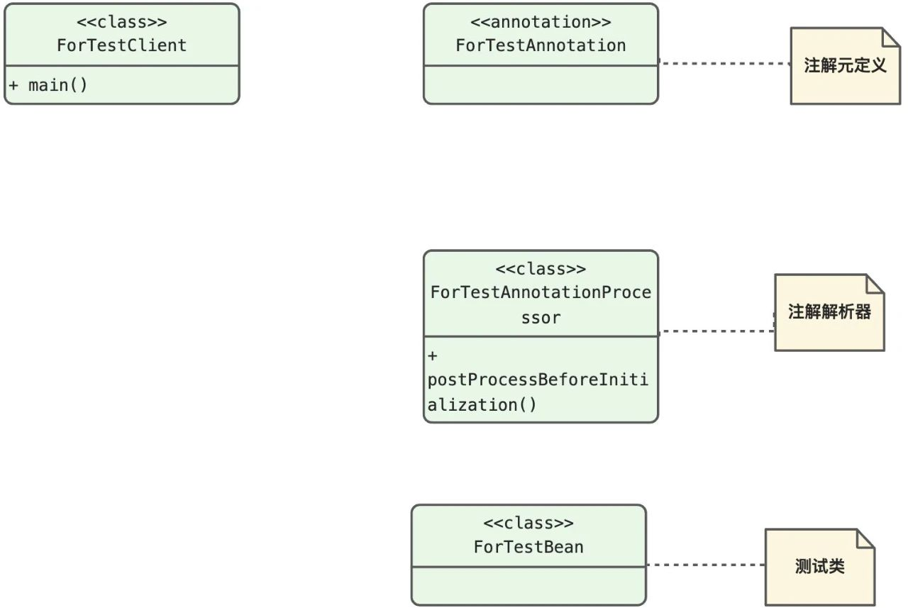
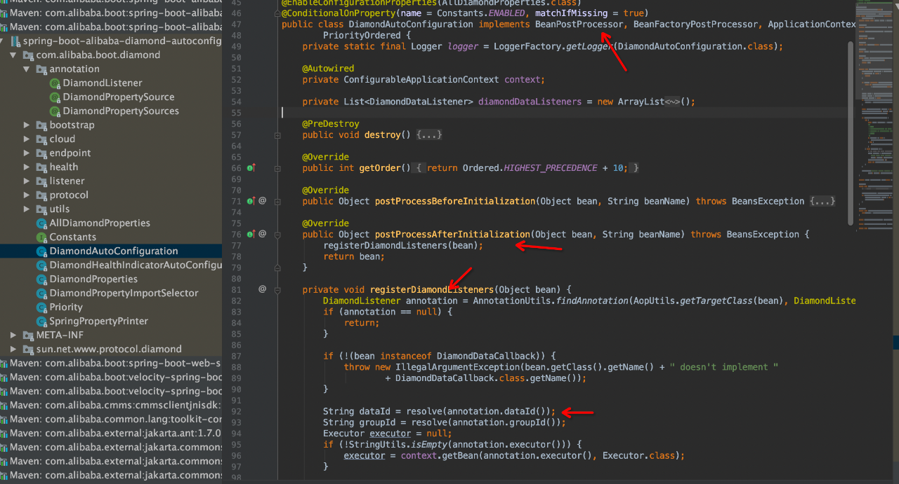

关键点

注解元定义----用来定义通用的元信息；
注解解析器----解析类上是否有指定的注解，进而进行对应的扩展操作；
spring的BeanPostProcessor----这里是借用spring的BeanPostProcessor机制，在spring容器初始化的时候，进行回调，完成预期的扩展行为；
适用场景

简化内部使用

常见框架中的应用

例如集团内部的spring-boot-alibaba-diamond-autoconfigure
