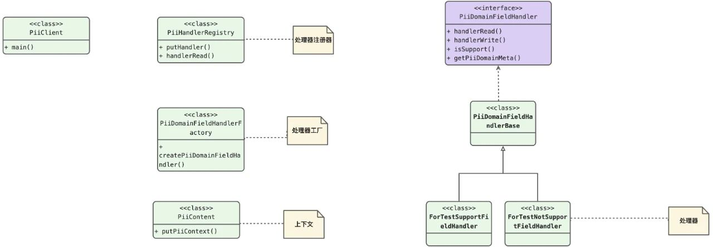

处理器注册器----用于存储处理器的集合

处理器工厂----用于创建处理器

处理器----实际的处理器以及扩展的实现

处理器上下文----处理器上下文，用于参数的传递

适用场景

适合于有共性、后续持续扩展的场景

这个就太多了，例如spring最核心的BeanPostProcessor机制，
通过org.springframework.beans.factory.support.AbstractBeanFactory#beanPostProcessors管理一些列的beanPostProcessors，
在spring上下文org.springframework.context.support.AbstractApplicationContext#refresh的时候，
进行bean的init(InitDestroyAnnotationBeanPostProcessor)、
解析注解(ScheduledAnnotationBeanPostProcessor、AutowiredAnnotationBeanPostProcessor)、
解析aop（AnnotationAwareAspectJAutoProxyCreator）等等。