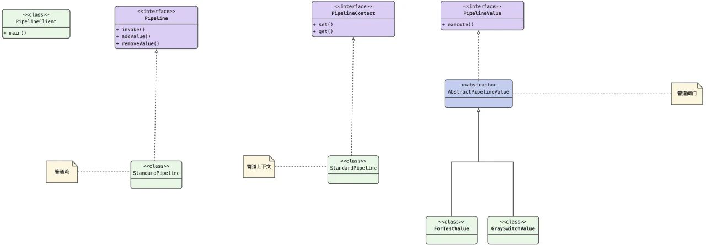
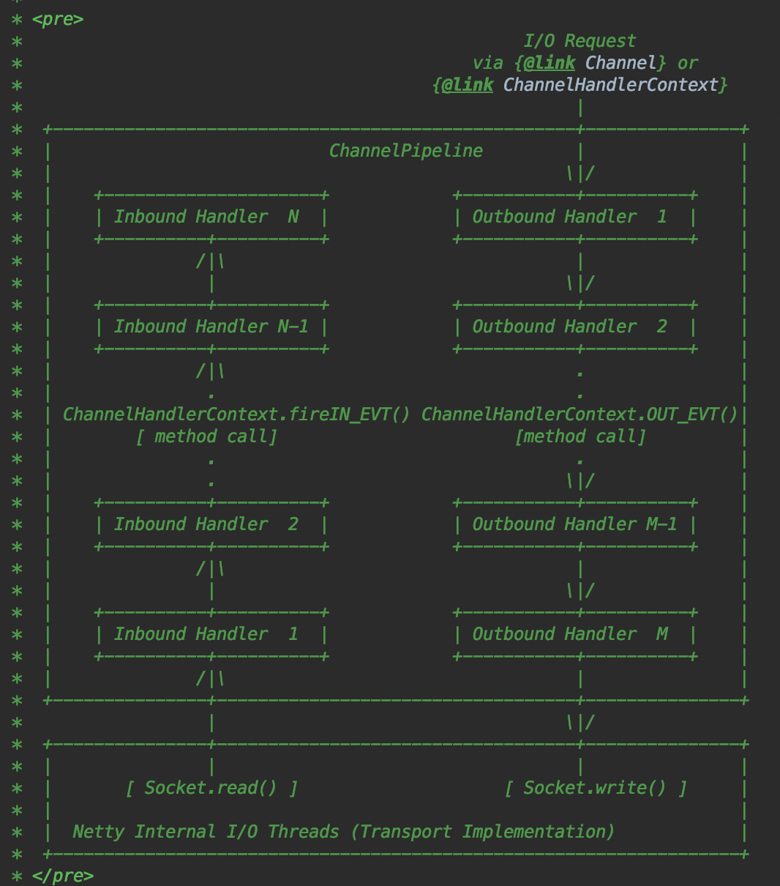

当你的数据流需要经过很多同等逻辑处理时，可以考虑使用此套路，便于后续扩展

管道(Pipeline)----用于串联阀门的管道通路

阀门(PipelineValue)----用于每一个节点处理实际业务诉求

管道上下文(PipelineContext)----用于管道上下文中数据的扭转

网络层的扛把子netty框架中，例如ChannelPipeline、ChannelHandler、ChannelHandlerContext，分别用于处理tcp拆包、加解码等等之类。

